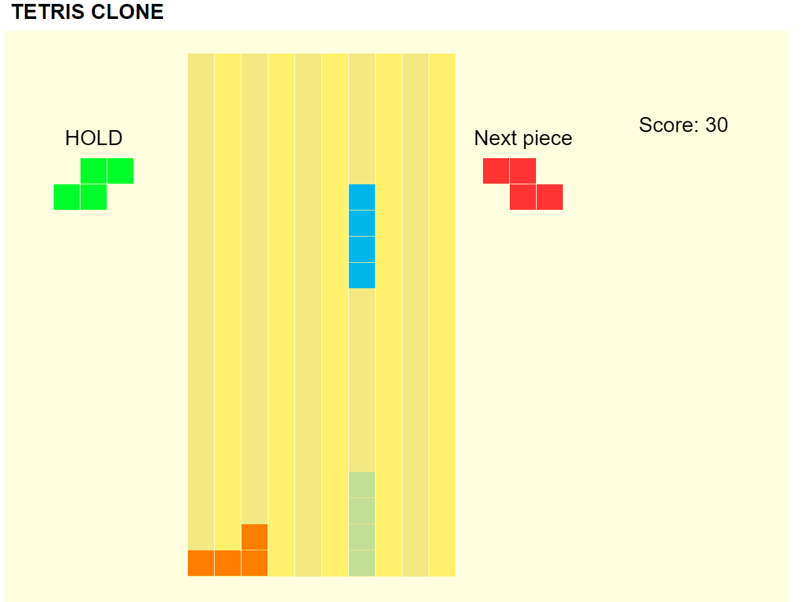

# Tetris clone written in JavaScript.
A simple Tetris clone written in Javascript for the browser, drawn using the Canvas API.
I was inspired by this gif on the Wikipedia article for Tetris:
https://commons.wikimedia.org/wiki/File:Tetris_Game_4-Line_Clear.gif.
I tried to replicate the look of the board, but more emphasis was given to the game logic.

## Table of contents
* [Purpose](#purpose)
* [Features](#features)
* [Technologies](#technologies)
* [Setup](#setup)
* [Controls](#controls)
* [Project Status](#project-status)
* [Room for Improvement](#room-for-improvement)

## Purpose
Simple project I found interesting for using with JavaScript. I also wanted to give 
making an old game clone a spin for a while.

## Features
- Tries to follow the SRS (Super Rotation System: https://harddrop.com/wiki/SRS).
- Next tetromino viewer.
- Swapping off a tetromino and saving it for later use.
- Ghost tetrominos.
- Hard drops.
- Barebones scoring system.
	
## Technologies
Minimal use of the Canvas API for drawing lines, rectangles and text.

## Setup
To run this project, download the files and run index.html on your browser.
Tested on Google Chrome Version 91.0.4472.124 (64-bit) and Firefox 89.0.2 (64-bit).

## Controls
- A, D: move tetromino left and right by one column.
- S: move tetromino one line downwards (soft drop).
- W: immediately drops the tetromino to where its ghost counterpart is (hard drop).
- Left/Right arrow keys: rotate the tetromino counter-clockwiese / clockwise.
- F: hold the tetromino, i.e. save the current tetromino for later use 
if it's the first one or swap it out for the current one if one is already saved.

## Project Status
The project is still a work in progress, as it is still not full featured. 
See below for shortcomings/ideas.

## Room for Improvement
- Controls tutorial.
- Saving high-scores.
- Actual UI with buttons to pause, start a new game / restart, information.
- Statistics + time.
- Resizing of board depending on window size.
- Pending optimizations, e.g. calculating the ghost piece position by caching
the highest occupied block on the board for every column.
- Different look / colors, as they are way too tiring to the eye.
